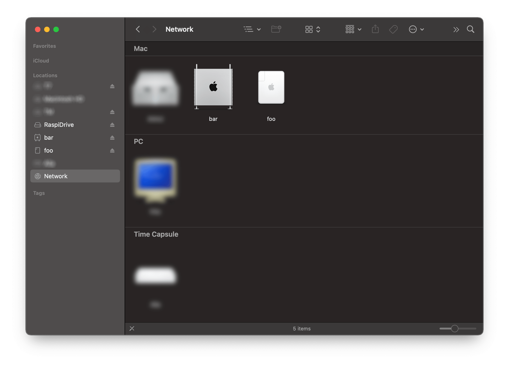
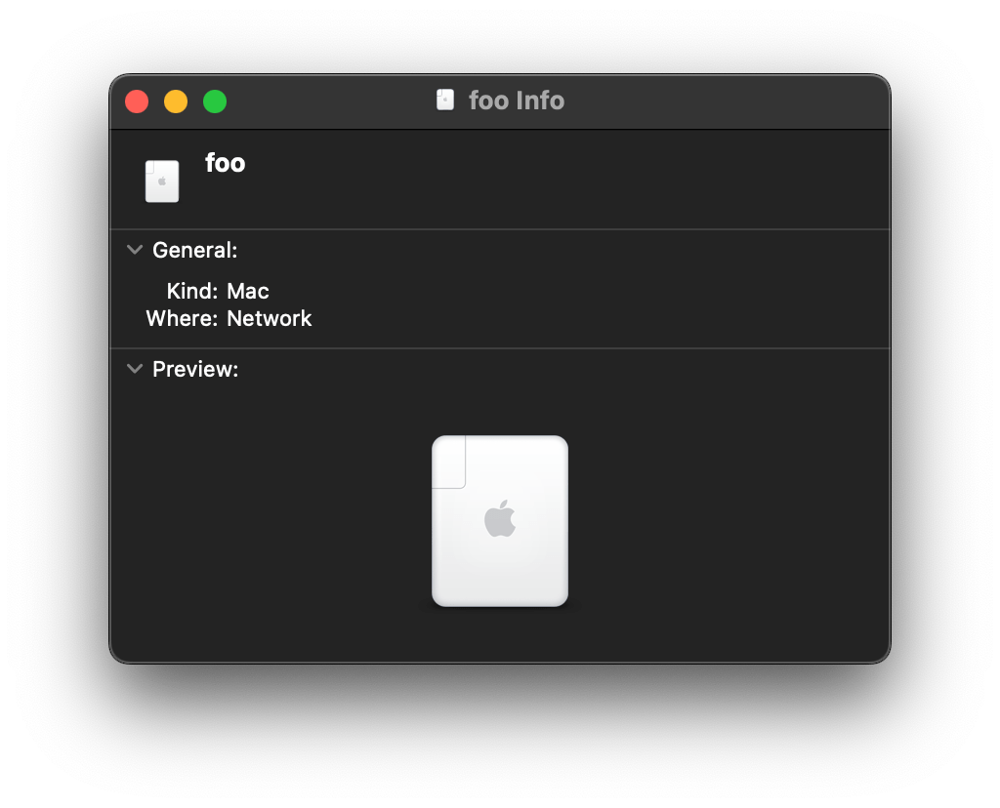
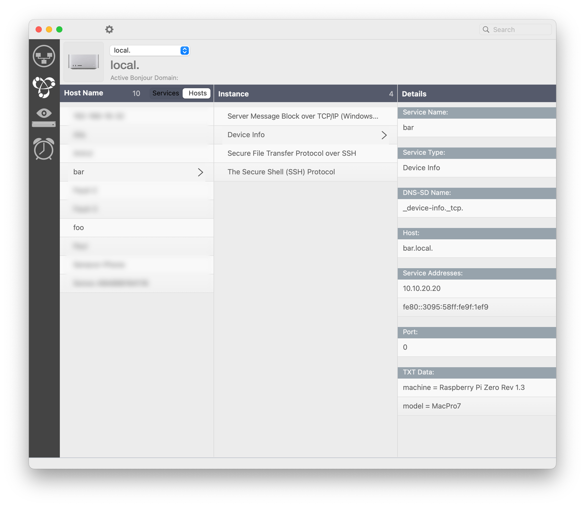

# Pi Hero  [](https://github.com/bkahlert/pihero/actions/workflows/ci.yml) [](https://github.com/bkahlert/pihero/blob/main/LICENSE) [](https://www.buymeacoffee.com/bkahlert)


**Pi Hero** makes your [Raspberry Pi](https://www.raspberrypi.com/) discoverable, reachable, and pleasant to use.

Every feature is a Debian package from a signed apt repository. One [cloud-init](https://cloudinit.readthedocs.io/) file
on the boot partition describes a device: flash a card, boot, and the Pi installs its packages and shows up in your network.
No control machine, no playbook.

## Packages

| Package               | What it does                                                                                                                                                            |
| --------------------- | ----------------------------------------------------------------------------------------------------------------------------------------------------------------------- |
| `pihero`              | The MOTD lists installed features, failed units, pending reboots, and the USB address; `bootconfig` edits the boot files safely                                         |
| `pihero-avahi`        | The Pi appears in Finder's network browser with an icon and its device information, announced as an SMB server because that is what Finder lists; SSH is advertised too |
| `pihero-usb-gadget`   | Ethernet over USB on top of Raspberry Pi's `rpi-usb-gadget`: a Mac on the cable gets an address from the Pi and lists the interface under the board's name              |
| `pihero-kiosk`        | One web page full screen on the display: cog (WPE WebKit) straight on the DRM device, no X server and no compositor; the page is `URL` in `/etc/pihero/kiosk.conf`      |

| [ Pis in the network browser](./docs/network-browser.png)     | [ device information](./docs/network-info-foo.png)     | [ device information with a custom model](./docs/device-info-bar.png)     |
| --------------------------------------------------------------------------------------------------------- | ---------------------------------------------------------------------------------------------------- | --------------------------------------------------------------------------------------------------------------------- |

Planned: Bluetooth PAN as `pihero-bt-pan`. Pi Hero 1, the Ansible playbook, is frozen at tag
[`pihero-ansible`](https://github.com/bkahlert/pihero/tree/pihero-ansible); [docs/pihero-1.md](docs/pihero-1.md) says what
became of each of its features.

## Quick start

You need a Mac with [Homebrew](https://brew.sh/), a Raspberry Pi (Zero W and up), and an SD card.

1. **Describe the device.** Copy the sample and edit it: hostname, your SSH public key, the pretty name, the Finder icon, the
   USB gadget's name, and your Wi-Fi in `network-config`; a Zero W or another ARMv6 board takes `# image: raspios_lite_armhf`
   in the header. The sample installs `pihero`, `pihero-avahi`, and `pihero-usb-gadget`; device directories other than
   `sample/` are gitignored.
   ```shell
   mkdir devices/mypi && cp devices/sample/user-data devices/sample/network-config devices/mypi/
   ```
2. **Flash.** Find the card with `diskutil list external`, then:
   ```shell
   brew bundle
   make flash DEVICE=mypi DISK=disk9
   ```
   Two minutes: the image is written, verified, and completed with your files. Raspberry Pi Imager works as well.
3. **Boot.** Six minutes and two reboots later `ssh pi@mypi.local` greets you with the MOTD, the Pi is in Finder, and a Mac on
   the USB cable gets an address from the gadget `pihero-usb-gadget` brought up, listed under the name you gave it.

`MODEL` in the device file picks the Finder icon. The three in use:

|                                          `AirPort4` (default)                                          |                                             `MacPro6,1`                                             |                                         `MacPro7,1@ECOLOR=226,226,224`                                         |
| :----------------------------------------------------------------------------------------------------: | :-------------------------------------------------------------------------------------------------: | :------------------------------------------------------------------------------------------------------------: |
|                  |                  |                  |
|  |  |  |

All ten choices are pictured in [devices/README.md](devices/README.md#the-finder-icon), along with every key of the device
file and what to do if the Pi does not show up. Updating a device is `sudo apt upgrade` on the Pi; changing it is a reflash.

## The apt repository

Releases are published to [bkahlert.github.io/pihero](https://bkahlert.github.io/pihero/), a flat repository signed with the
key in [docs/pihero-apt.asc](docs/pihero-apt.asc) (fingerprint `DE60 9D7F F5BE 430D AC8C C807 081F 70E6 A077 DF7A`). The
device file embeds that key, so a device trusts nothing else.

## Development

Everything runs on the Mac; a Raspberry Pi is optional.

### Prerequisites

```shell
brew bundle                                  # qemu, podman, uv
podman machine init && podman machine start
make doctor                                  # lists what is missing
```

### Repository layout

| Directory              | Contents                                                                                                                                                        |
| ---------------------- | --------------------------------------------------------------------------------------------------------------------------------------------------------------- |
| [packages/](packages)  | One directory per Debian package: what it installs under `root/`, its `nfpm.yaml` manifest, its tests                                                           |
| [testkit/](testkit)    | The test harness: the pytest plugin and the commands behind `make`; builds the packages and tests them in podman containers, a QEMU VM, or on a Pi over SSH     |
| [devices/](devices)    | Device files, one directory per device, documented in [devices/README.md](devices/README.md); only `sample/` is committed                                       |
| [docs/](docs)          | Design, testing, and platform notes                                                                                                                             |

### Build and test

```shell
make build                          # every package into dist/
make test-tier0                     # unit tests and static checks
make test-tier1                     # install, remove, purge in a systemd container
make test-tier2                     # boot a QEMU VM from a device file
make test                           # tiers 0 and 1, what CI runs on every push
make test-all                       # tiers 0 to 2, what make release runs
make deploy TARGET=pi@mypi.local    # the built packages onto a real device
make dump-model-icons OUT=dir       # every Finder device icon, sidebar template, and SF Symbol in CoreTypes.bundle
```

What each tier proves and how to write a test is in [docs/testing.md](docs/testing.md).

### Release

```shell
make release VERSION=2.1.0   # clean tree required; runs tiers 0 to 2, then tags v2.1.0
git push origin v2.1.0       # CI builds, signs, and publishes
```

### See also

- [docs/design.md](docs/design.md): the decisions and their reasons
- [docs/raspberry-pi-os.md](docs/raspberry-pi-os.md): Raspberry Pi OS and cloud-init quirks the device file works around
- [docs/app-conventions.md](docs/app-conventions.md): conventions for applications built on top of Pi Hero

## Contributing

Want to contribute? Awesome! The most basic way to show your support is to star the project, or to raise issues. You
can also support this project by making
a [PayPal donation](https://www.paypal.me/bkahlert) to ensure this journey continues indefinitely!

Thanks again for your support, it is much appreciated! :pray:

## License

MIT. See [LICENSE](LICENSE) for more details.
