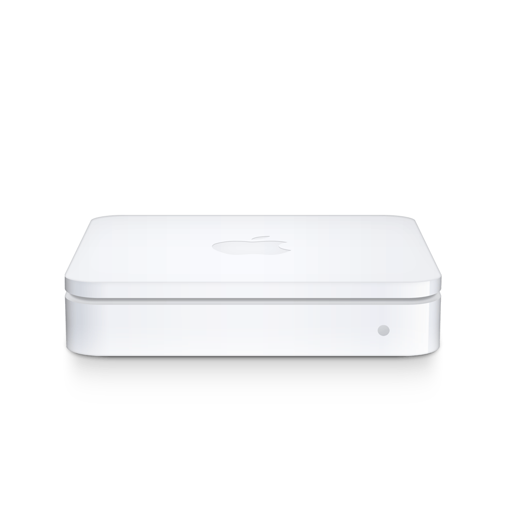
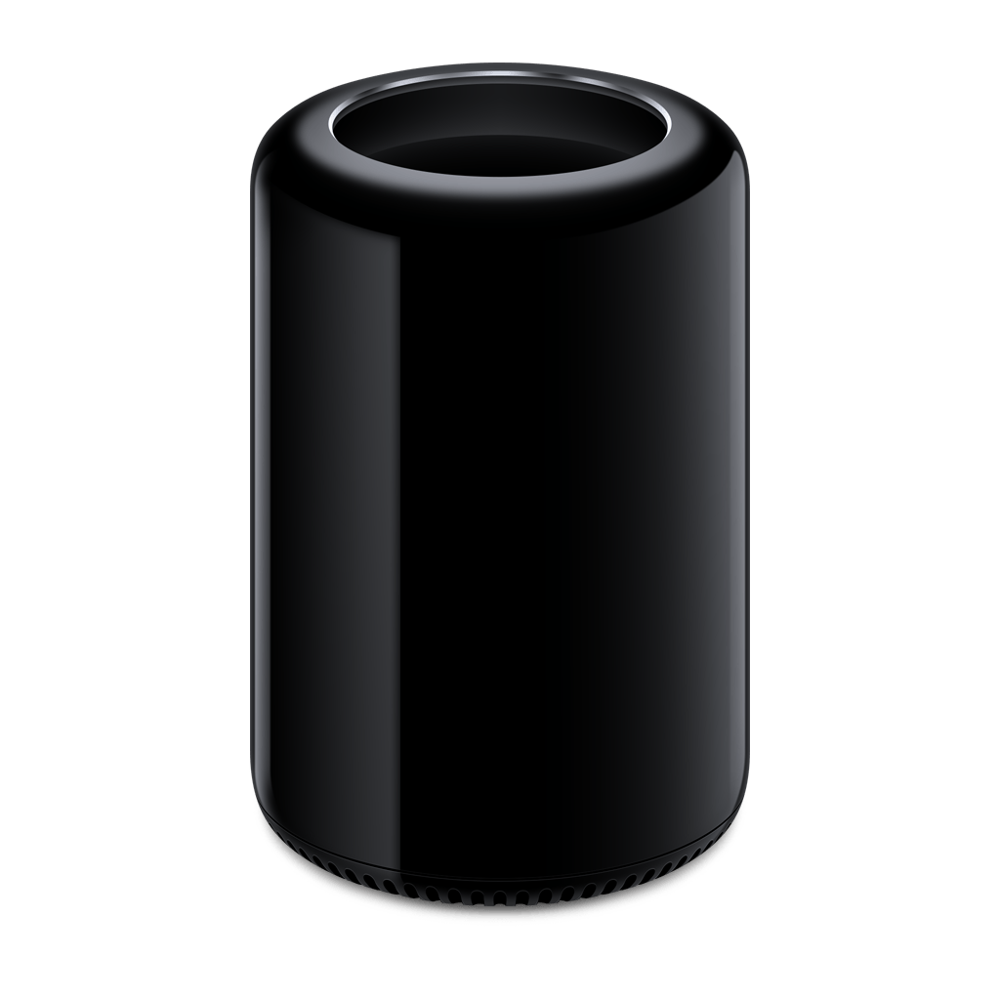
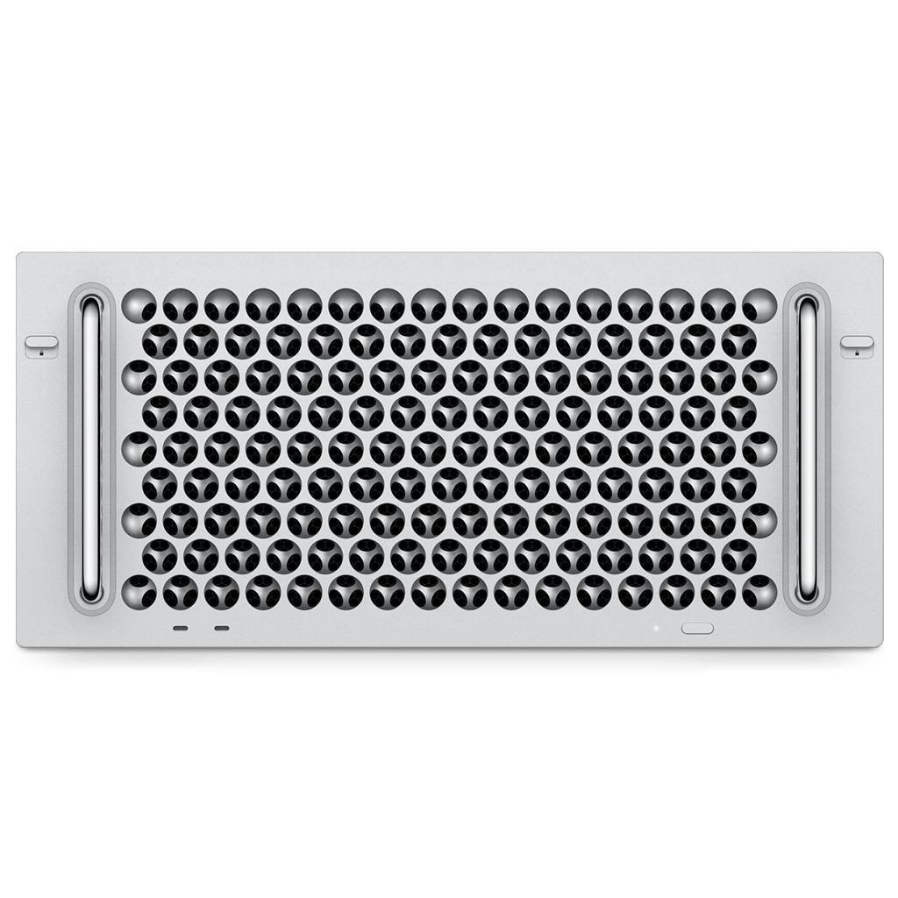
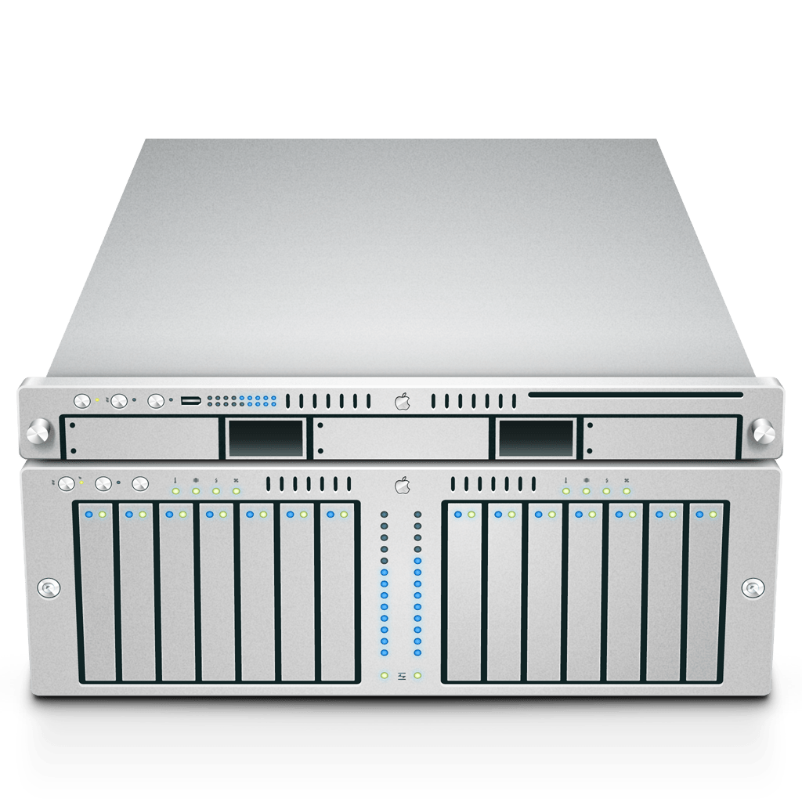

# Device files

One directory per device with the cloud-init files that go onto the boot partition after flashing: `user-data` (required),
`network-config` (Wi-Fi, optional), `meta-data` (optional). Directories other than [`sample/`](sample/) are gitignored; keep
them here or in a private repository. The reasons behind the workarounds in the sample are in
[docs/raspberry-pi-os.md](../docs/raspberry-pi-os.md).

## user-data

[sample/user-data](sample/user-data) is a complete device. Top to bottom:

- `hostname`, `timezone`, `enable_ssh`, `ssh_pwauth: false`, and `users` with your public key: plain cloud-init. Keep
  `lock_passwd: true`; the key is the only way in.
- `rpi: interfaces:` switches SPI, I²C, and the GPIO UART. Changing them costs the first of the two provisioning reboots.
- `bootcmd` orders cloud-init's final stage after the clock is synced, so apt trusts the repository signatures on a fresh card.
- `packages` names what to install; add applications here. `package_update: true` refreshes the index first.
- `write_files` puts the signed apt source in place (the key is inline, so the device trusts nothing else), the two files of
  the USB gadget (`g_cdc.conf` names the gadget, `usb-gadget.service` loads it after NetworkManager with MACs derived from
  the board serial), and `/etc/pihero/device-info.conf` with the `MODEL` for the Finder icon.
- `runcmd` sets the pretty name the Pi is advertised under, restarts the Avahi renderer, enables Ethernet over USB and
  requests the reboot that loads it, sets the USB subnet, and holds the commented Tailscale lines: install, join with an
  auth key, and, for an exit node, forwarding plus `--advertise-exit-node`.
- `power_state` reboots when something left `/run/reboot-required` behind.

## network-config

[sample/network-config](sample/network-config) is netplan as Imager writes it: one access point with its passphrase, DHCP,
`optional: true`, and `regulatory-domain`. `make flash` copies the domain onto the kernel command line; without it the first
boot has no Wi-Fi.

## The Finder icon

`MODEL` in `device-info.conf` selects the icon. `AirPort4` is the default: recognised everywhere and a small network device
rather than a computer. Other good choices:

| Model   |                                            `AirPort4`                                            |                                            `AirPort5`                                            |                                         `AirPort6`                                         |                                        `Macmini8,1`                                        |                                        `Macmini9,1`                                        |                                            `MacPro6,1`                                            |                                   `MacPro5,1`                                   |                       `MacPro7,1` `@ECOLOR=` `225,225,223`                        |                                 `MacPro7,1` `@ECOLOR=` `226,226,224`                                  |                                   `Xserve3,1`                                   |
|---------|:------------------------------------------------------------------------------------------------:|:------------------------------------------------------------------------------------------------:|:------------------------------------------------------------------------------------------:|:------------------------------------------------------------------------------------------:|:------------------------------------------------------------------------------------------:|:-------------------------------------------------------------------------------------------------:|:-------------------------------------------------------------------------------:|:-----------------------------------------------------------------------------------------:|:-------------------------------------------------------------------------------------------------------------:|:-------------------------------------------------------------------------------:|
| Kind    |                                               Mac                                                |                                         AirPort Extreme                                          |                                        Time Capsule                                        |                                            Mac                                             |                                            Mac                                             |                                                Mac                                                |                                       Mac                                       |                                            Mac                                            |                                                      Mac                                                      |                                       Mac                                       |
| Icon    |                   |                   |                   |                   |                   |                   |                   |                   |                   |                   |
| Sidebar |  |  |  |  |  |  |  |  |  |  |

Changing it later: edit `/etc/pihero/device-info.conf` on the Pi and `systemctl restart pihero-avahi-render.service`.

## Flash

Find the card with `diskutil list external`, then:

    make flash DEVICE=<host> DISK=disk9

This writes the pinned Raspberry Pi OS Lite (Trixie) image, reads it back to verify, copies the device files onto the boot
partition, puts the Wi-Fi regulatory domain on the kernel command line, and ejects the card. macOS asks once for
authorization; the card takes about two minutes. Raspberry Pi Imager works too: set the Wi-Fi country in its customisation
and nothing else, then copy `user-data` and `network-config` to `/Volumes/bootfs/` before ejecting.

## First boot

Provisioning takes about six minutes and reboots twice, once for the interface settings and once for the USB gadget. Then
`ssh pi@<host>.local` greets you with the MOTD, the Pi is in Finder with its icon, and a Mac on the USB cable has an address
from it. A display shows `Failed to start userconfig.service` once during the first boot and re-prints the login prompt when
an address changes; both are Raspberry Pi OS behaviour.

If it does not show up after ten minutes: connect over USB (`ssh pi@10.10.10.10` with the sample's subnet) or Wi-Fi and read
`/var/log/cloud-init-output.log`, then `cloud-init status --long` and `journalctl -b -u NetworkManager`. With no way in, put
the card back into the Mac: `/Volumes/bootfs` holds `cmdline.txt` and `config.txt`, and the root partition can be read with
`debugfs -c` in the tools container from a dump; see [docs/raspberry-pi-os.md](../docs/raspberry-pi-os.md).

## Later changes

cloud-init runs once per card, so a changed device file means a reflash. Updates are `sudo apt update && sudo apt upgrade` on
the Pi; the MOTD says when a reboot is due. Small things are done live and survive updates: the icon as above, network
settings with `nmcli`, boot settings with `/usr/lib/pihero/bootconfig`.
