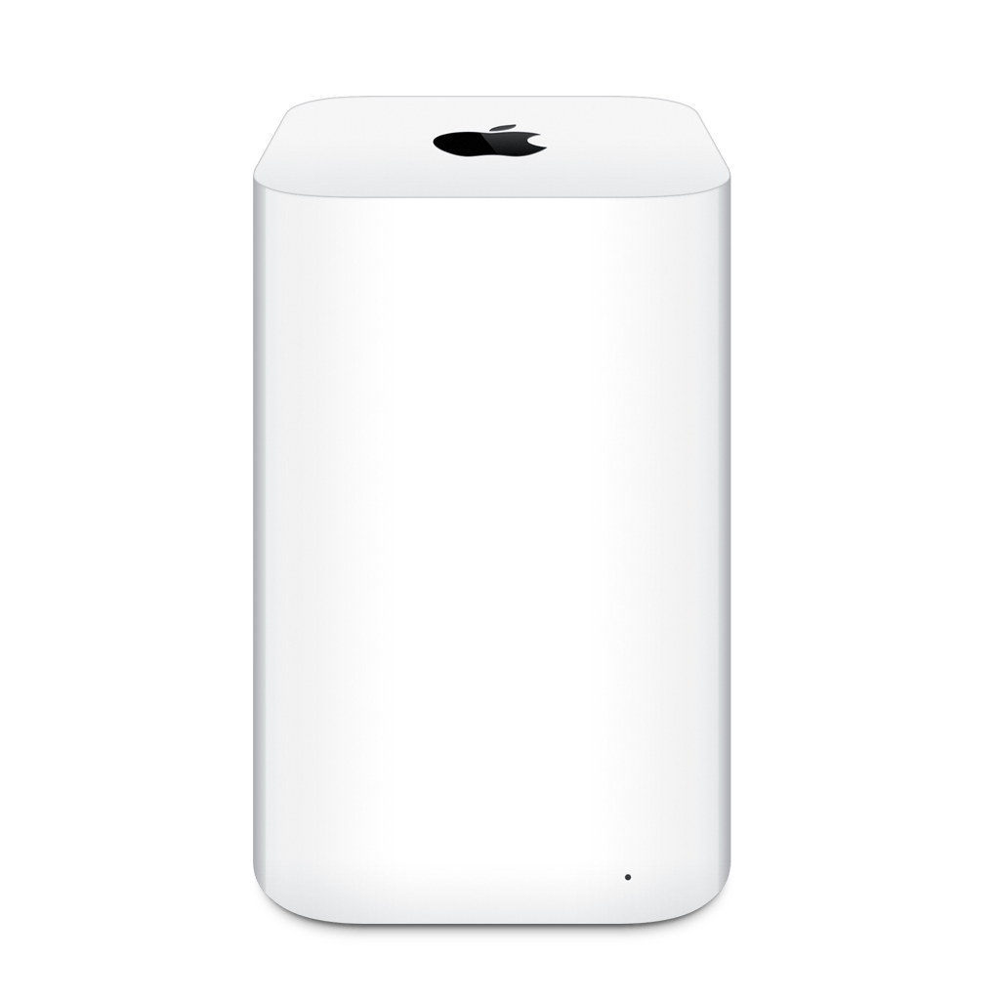
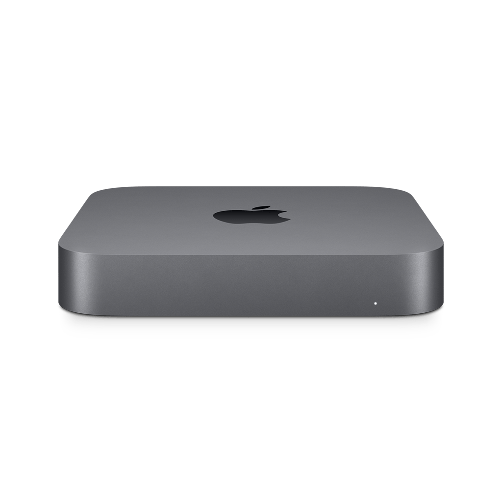
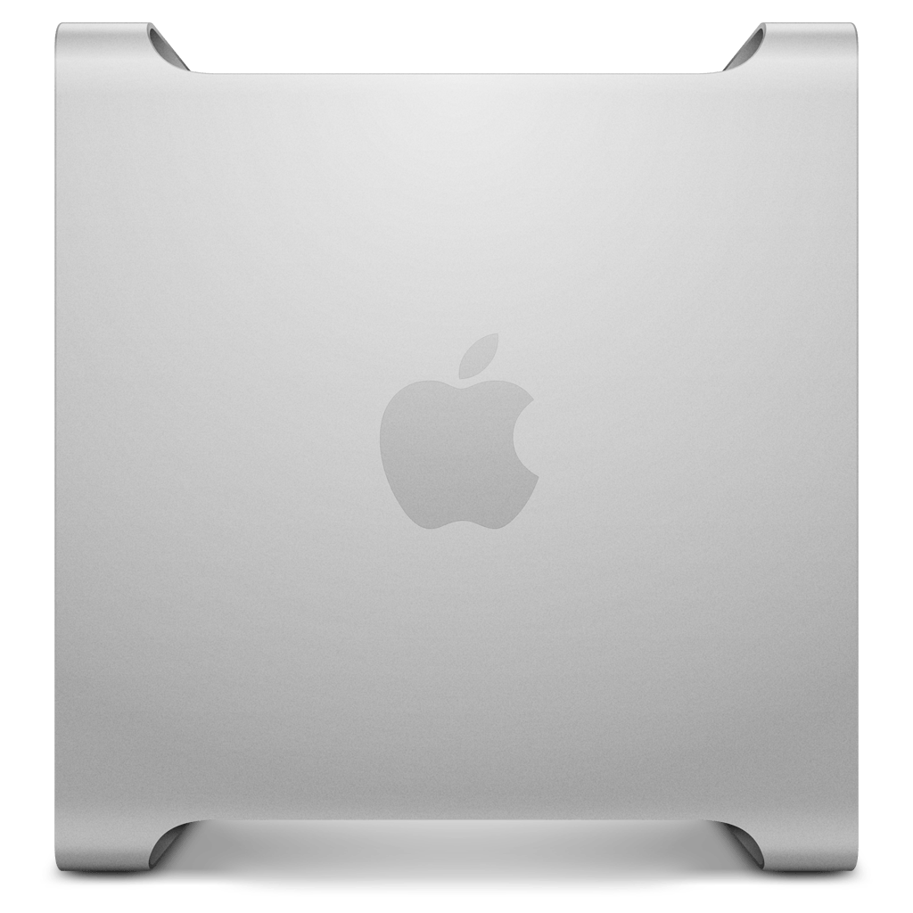
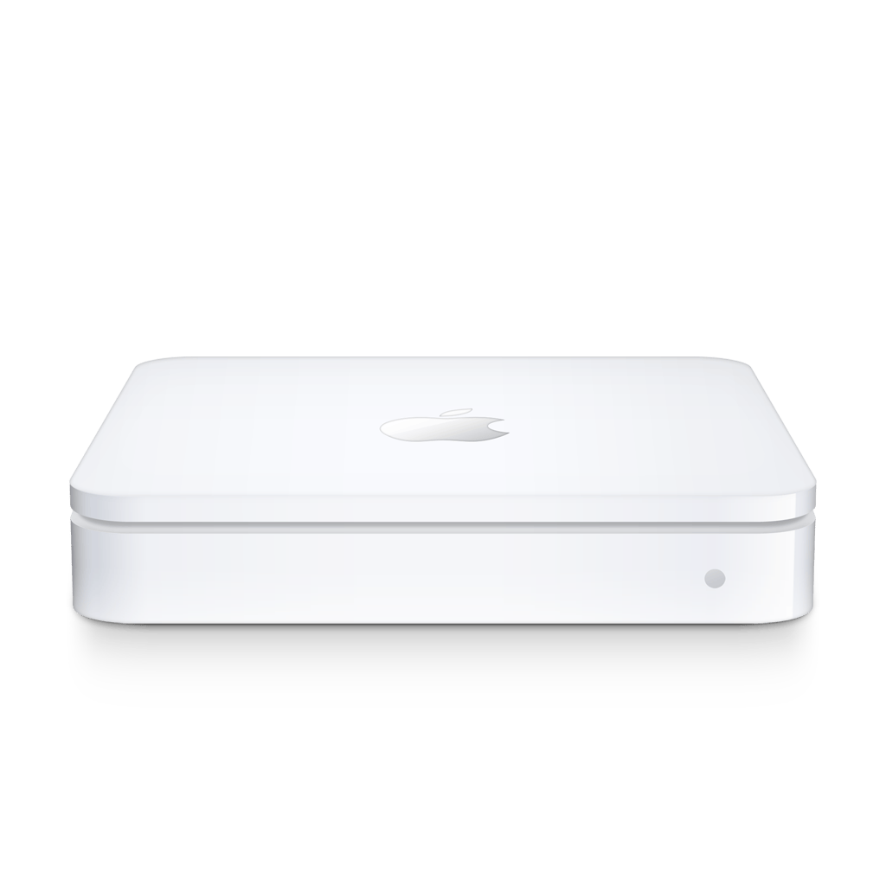
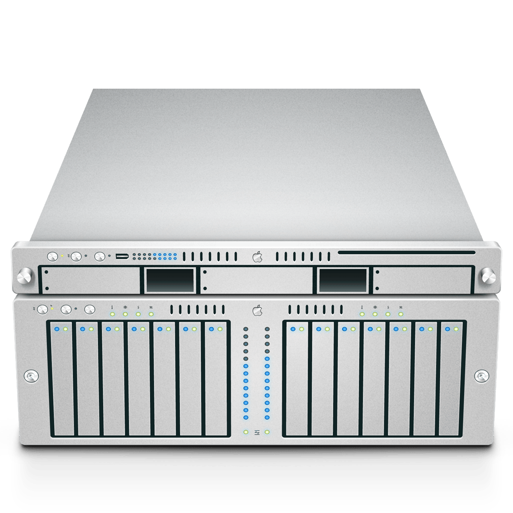

# Devices

One directory per device with the cloud-init files that go onto the boot partition after flashing: `user-data` (required),
`network-config` (Wi-Fi, optional), `meta-data` (optional). Directories other than [`sample/`](sample) are gitignored; keep
them here or in a private repository. Everything an operator does with a device is on this page; the Mac needs
[Homebrew](https://brew.sh/) and `brew bundle` first.

## Describe a device

### user-data

[sample/user-data](sample/user-data) is a complete device. Its keys, top to bottom:

| Key                               | Sets                                                                                                                                    | Notes                                                                                                                                                   |
| --------------------------------- | --------------------------------------------------------------------------------------------------------------------------------------- | ------------------------------------------------------------------------------------------------------------------------------------------------------- |
| `# image:` (header comment)       | The image `make flash` writes: `raspios_lite_arm64` for the Zero 2 W and up, `raspios_lite_armhf` for the Zero W and other ARMv6 boards | 64-bit when absent; the names are the tables of [images.lock](../testkit/src/pihero_testkit/images.lock)                                                |
| `hostname`, `timezone`, `users`   | Hostname, time zone, the `pi` user with your public key                                                                                 | Plain cloud-init. Keep `lock_passwd: true` and `ssh_pwauth: false`; the key is the only way in                                                          |
| `rpi: interfaces:`                | SPI, I²C, and the GPIO UART                                                                                                             | Changing them costs the first of the two provisioning reboots                                                                                           |
| `bootcmd`                         | Orders cloud-init's final stage after the clock is synced                                                                               | Without it apt rejects the repository signatures on a fresh card; see [docs/raspberry-pi-os.md](../docs/raspberry-pi-os.md)                             |
| `packages`                        | What to install; add applications here                                                                                                  | `package_update: true` refreshes the index first                                                                                                        |
| `write_files`                     | The signed apt source, `/etc/pihero/device-info.conf` (`MODEL`, the Finder icon), `/etc/pihero/usb-gadget.conf` (`PRODUCT`, `CIDR`)     | The key is inline, so the device trusts nothing else                                                                                                    |
| `runcmd`                          | The pretty name the Pi is advertised under, then restarts the Avahi renderer                                                            | Holds the commented Tailscale lines: install, join with an auth key, and for an exit node forwarding plus `--advertise-exit-node`                       |
| `power_state`                     | Reboots when a package left `/run/reboot-required` behind                                                                               | `pihero-usb-gadget` does on its first install                                                                                                           |

The reasons behind the workarounds are in [docs/raspberry-pi-os.md](../docs/raspberry-pi-os.md).

### network-config

[sample/network-config](sample/network-config) is netplan as Imager writes it: one access point with its passphrase, DHCP,
`optional: true`, and `regulatory-domain`. `make flash` copies the domain onto the kernel command line; without it the first
boot has no Wi-Fi.

### The Finder icon

`MODEL` in `device-info.conf` selects the icon. `AirPort4` is the default: recognised everywhere and a small network device
rather than a computer. Other good choices:

<!-- docs-models -->
| Model identifier | `AirPort4` | `AirPort5` | `AirPort7,120` | `Macmini8,1` | `Macmini9,1` | `MacPro5,1` | `MacPro6,1` | `AirPort6` | `Xserve3,1` | `MacPro7,1`<br/>`@ECOLOR=`<br/>`225,225,223` | `MacPro7,1`<br/>`@ECOLOR=`<br/>`226,226,224` |
| --- | :-: | :-: | :-: | :-: | :-: | :-: | :-: | :-: | :-: | :-: | :-: |
| Type identifier | `com.apple.airport-express` | `com.apple.airport` | `com.apple.airport-extreme-tower` | `com.apple.macmini-2018` | `com.apple.macmini-2020` | `com.apple.macpro-firewire` | `com.apple.macpro-cylinder` | `com.apple.time-capsule` | `com.apple.xserve-xeon` | `com.apple.macpro-2019` | `com.apple.macpro-2019-rackmount` |
| Kind | Mac | AirPort Extreme | AirPort Extreme | Mac | Mac | Mac | Mac | Time Capsule | Mac | Mac | Mac |
| Icon |  |  |  |  |  |  |  |  |  |  |  |
| Sidebar icon |  |  |  |  |  |  |  |  |  |  |  |

<!--
The table above is generated by `make docs-models`, which runs

    uvx --from git+https://github.com/bkahlert/device-icons@v0.2.0 device-icons icons export --horizontal --no-open \
      --model AirPort4 --model AirPort5 --model AirPort6 --model AirPort7,120 --model Macmini8,1 \
      --model Macmini9,1 --model MacPro6,1 --model MacPro5,1 --model MacPro7,1@ECOLOR=225,225,223 \
      --model MacPro7,1@ECOLOR=226,226,224 --model Xserve3,1

then keeps the export's icons/ and sidebar/ as docs/models/, quantised with pngquant, and splices in its table with
the image paths prefixed with ../docs/models/.
-->
<!-- /docs-models -->

Changing it later: edit `/etc/pihero/device-info.conf` on the Pi and `systemctl restart pihero-avahi-render.service`.

The pictures come from macOS itself: `make docs-models` regenerates them and this table with
[device-icons](https://github.com/bkahlert/device-icons) from this Mac's `CoreTypes.bundle`, so they change with macOS.
`device-icons icons preview <model identifier>` announces a candidate so Finder's Network view shows its icon.

### Ethernet over USB

`pihero-usb-gadget` turns on Raspberry Pi's `rpi-usb-gadget` and loads a CDC ECM gadget with MACs derived from the board
serial, so a Mac sees the same device on every boot. `/etc/pihero/usb-gadget.conf` takes two optional keys:

| Key         | Default                                                   | Notes                                                                                                            |
| ----------- | --------------------------------------------------------- | ---------------------------------------------------------------------------------------------------------------- |
| `PRODUCT`   | The board model, such as `Raspberry Pi Zero 2 W Rev 1.0`  | The name the host lists the gadget under; double-quoted when it contains spaces. The sample uses the pretty name |
| `CIDR`      | Upstream's `10.12.194.1/28`                               | The address the Pi serves to the host                                                                            |

Changing them later: edit the file on the Pi and reboot. `rpi-usb-gadget` supports the Zero, Zero W, Zero 2 W, 3A+, 4B, 5,
500, and Compute Modules 0 and 5; any other board refuses the package on purpose, because peripheral mode would take the
board's only USB controller away from its USB ports and Ethernet. Windows has no driver for CDC ECM;
[docs/raspberry-pi-os.md](../docs/raspberry-pi-os.md) says why upstream's `g_ether` is not used and how macOS names the gadget.

## Flash

Find the card with `diskutil list external`, then:

    make flash DEVICE=<name> DISK=disk9          # a directory under devices/, or under the directory .env names
    make flash DEVICE=<path> DISK=disk9          # or a device directory anywhere, such as a private repository

This

1. writes the pinned Raspberry Pi OS Lite image the device file names,
2. reads it back to verify,
3. copies the device files onto the boot partition,
4. puts the Wi-Fi regulatory domain on the kernel command line,
5. ejects the card,
6. forgets the host in Ghostty's ssh-terminfo cache, so the next `ssh` from Ghostty installs its terminfo on the new card
   instead of sending a `TERM` the card does not know.

macOS asks once for authorization; the card takes about two minutes. Raspberry Pi Imager works too: set the Wi-Fi country
in its customisation and nothing else, then copy `user-data` and `network-config` to `/Volumes/bootfs/` before ejecting.

Device directories kept in another repository are reached by name through a gitignored `.env` at the repository root that
`make` reads: `PIHERO_DEVICES=~/fleet/devices` makes `make flash DEVICE=checkpoint` look there after `devices/`.

## First boot

Provisioning takes about six minutes and reboots twice, once for the interface settings and once for the USB gadget. Then
`ssh pi@<host>.local` greets you with the MOTD, the Pi is in Finder with its icon, and a Mac on the USB cable has an address
from it. A display shows `Failed to start userconfig.service` once and re-prints the login prompt when an address changes;
both are Raspberry Pi OS behaviour.

### If the Pi does not show up

1. After ten minutes, connect over USB (`ssh pi@10.10.10.10` with the sample's subnet) or Wi-Fi and read
   `/var/log/cloud-init-output.log`, then `cloud-init status --long` and `journalctl -b -u NetworkManager`.
2. With no way in, put the card back into the Mac: `/Volumes/bootfs` holds `cmdline.txt` and `config.txt`.
3. The root partition can be read with `debugfs -c` in the tools container from a dump; see
   [docs/raspberry-pi-os.md](../docs/raspberry-pi-os.md).

## Change a device

cloud-init runs once per card, so a changed device file means a reflash. Small things are done live on the Pi and survive
updates:

- the Finder icon: `/etc/pihero/device-info.conf`, then `systemctl restart pihero-avahi-render.service`
- the gadget's name and subnet: `/etc/pihero/usb-gadget.conf`, then a reboot
- network settings: `nmcli`
- boot settings: `/usr/lib/pihero/bootconfig`

## Update a device

```shell
ssh pi@mypi.local sudo apt update '&&' sudo apt upgrade
```

The repository is signed; the device trusts only the key embedded in its device file. Reboot when the MOTD says so.

## Back up a device

Before a risky change, or once a device holds state its device file cannot recreate, image its card. Power the Pi off, put the
card into the Mac, and:

```shell
make backup                       # asks which card; the image is named after the Pi and the day
make restore                      # asks which image and which card, confirms, writes, verifies, ejects
```

Images land in `backups/<hostname>-<date>.img.xz`, gitignored, next to a `.toml` with the size and checksum a restore checks
first. The hostname comes from the card's `user-data`; `NAME=` overrides it, and `DISK=` and `IMAGE=` skip the questions; a
restore given both writes without asking. Like a flash, a restore forgets the host the image is named after in Ghostty's
ssh-terminfo cache.
A 16 GB card took six minutes to back up and nineteen to restore, the card's own write speed setting the latter; a 32 GB card
takes about twice that. Restore needs a card at least as large as the one imaged, and a nominally equal card from another
maker can be a few megabytes short, so when replacing a card buy the next size up. On a larger card the root filesystem keeps
its old size until `sudo raspi-config --expand-rootfs` and a reboot.

## Cards from before pihero-usb-gadget

A card provisioned before `pihero-usb-gadget` existed carries its own `usb-gadget.service` and `g_cdc.conf` from the old
sample; they would race the package's unit for the module. Reflash it, or remove them before installing the package and
reboot afterwards:

    sudo systemctl disable --now usb-gadget.service
    sudo rm /etc/systemd/system/usb-gadget.service /etc/modprobe.d/g_cdc.conf
    sudo systemctl daemon-reload
