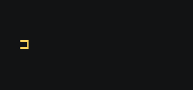
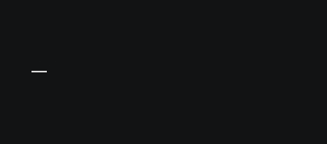
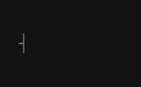
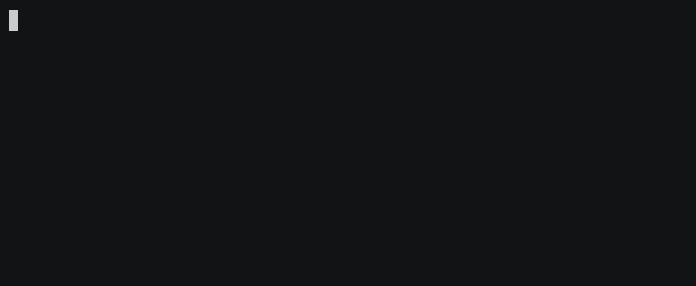
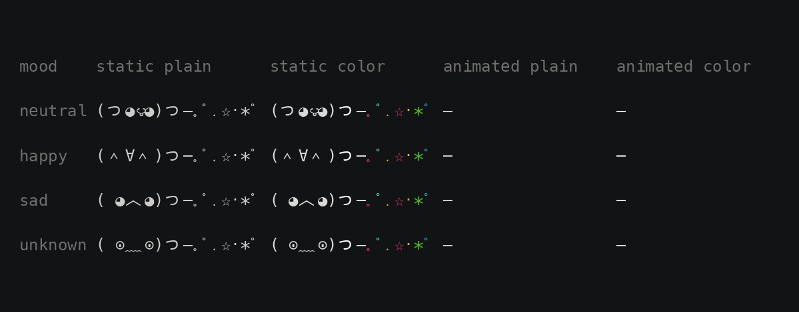
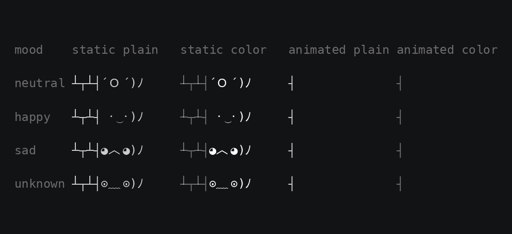

# Kaomoji

The Pi Hero cast: three animated faces for the terminal, one Go program, [kaomoji.go](kaomoji.go), standard library
only. `kaomoji hero`, `kaomoji wizard`, and `kaomoji visitor` print one kaomoji each, static unless animated, colored on
a terminal; `kaomoji <character> --help` lists its moods and options. How the engine paints and paces, how the package is
built, and what was measured on a Raspberry Pi 1 is in [docs/design.md](../../docs/design.md#kaomoji). The tests in
[tests](tests) run in tier 0.

```shell
curl -fsSL https://github.com/bkahlert/pihero/releases/latest/download/hero | bash -s -- --animate --exit
```

That line fetches the binary for this machine once, into `~/.cache/kaomoji/`, checks it against the hash in the script,
and runs it; `wizard`, `visitor`, and `kaomoji` are published the same way, the last taking the character as its first
argument. Linux and macOS, arm64 and amd64, and every 32-bit Raspberry Pi. `apt install kaomoji` from the Pi Hero
repository puts `/usr/bin/kaomoji` on a Pi; `pihero` depends on it for its MOTD. In a checkout, `go run kaomoji.go hero`
needs nothing but Go, and `make .build/kaomoji` builds the binary through the tools image without a Go of your own.

| Character          | Face                                                                                                           | Animation                              |
| ------------------ | -------------------------------------------------------------------------------------------------------------- | -------------------------------------- |
| `kaomoji hero`     | The Pi Hero, `─=≡▰▩▩[ 蓬•ｏ•]━`: flies in from the left, hovers with a flickering tail, flies out through the right edge of the terminal |                |
| `kaomoji wizard`   | The Netmon wizard, `(つ◕౪◕)つ─｡ﾟ․☆･*ﾟ`: slides in, conjures the magic particle by particle, slides out         |            |
| `kaomoji visitor`  | The Busy Screen visitor, `┴┬┴┤´Ｏ´)ﾉ`: peeks out from behind a wall, waves and blinks, ducks back            |          |

```shell
kaomoji hero                                # one static kaomoji
kaomoji hero --mood happy --animate --exit  # flies in, hovers until Ctrl-C, then flies out
kaomoji wizard --loops 3 --exit             # entrance, three hover cycles, exit
kaomoji visitor --preview                   # every mood and style in a grid, animated
```

`--no-animation` undoes the animation options before it, so a wrapper can append it to an app's flags, and `ACCESSIBLE`
set in the environment, to anything, keeps every call static whatever the flags say, as Charm's `huh` and `gum` do; color
stays with `NO_COLOR`.

## Preview grids

One row per mood, one column per style: static and animated, each plain and colored.







## Building

[build](build) runs in the testkit's tools image, which has Go and nfpm: it cross-compiles the five binaries, packs the
Linux ones as `kaomoji_<version>_{armhf,arm64,amd64}.deb` from [nfpm.yaml.in](nfpm.yaml.in), and renders
[bootstrap.sh](bootstrap.sh) under the four names with the version, the character, and the binaries' hashes baked in.
`make build` at the repository root runs it along with every other package; the release workflow attaches everything it
produces to the GitHub release.

## Rendering the GIFs

[kaomoji-gif](kaomoji-gif) records a command with [asciinema](https://asciinema.org) and renders the recording with
[agg](https://github.com/asciinema/agg). The [Makefile](Makefile) holds the settings of the GIFs on this page; in this
directory:

```shell
brew install asciinema agg
make                                                                      # every GIF whose program or renderer changed
./kaomoji-gif -- ./.build/kaomoji hero --animate --no-entrance --loops 1   # hero.gif: hovering once, a seamless loop
./kaomoji-gif --help                                                      # font, size, padding, hold, theme
```

An endless animation never finishes recording, so give the command `--loops`.

The badge in the title of the repository's README, [assets/hero-badge.gif](../../assets/hero-badge.gif), is a one-off: a
recording of the hovering hero cut to 40 px with ffmpeg, grey and rounded like the badges next to it. It is kept as a file
with the logo, not rendered here, so that this renderer needs nothing but asciinema and agg.
